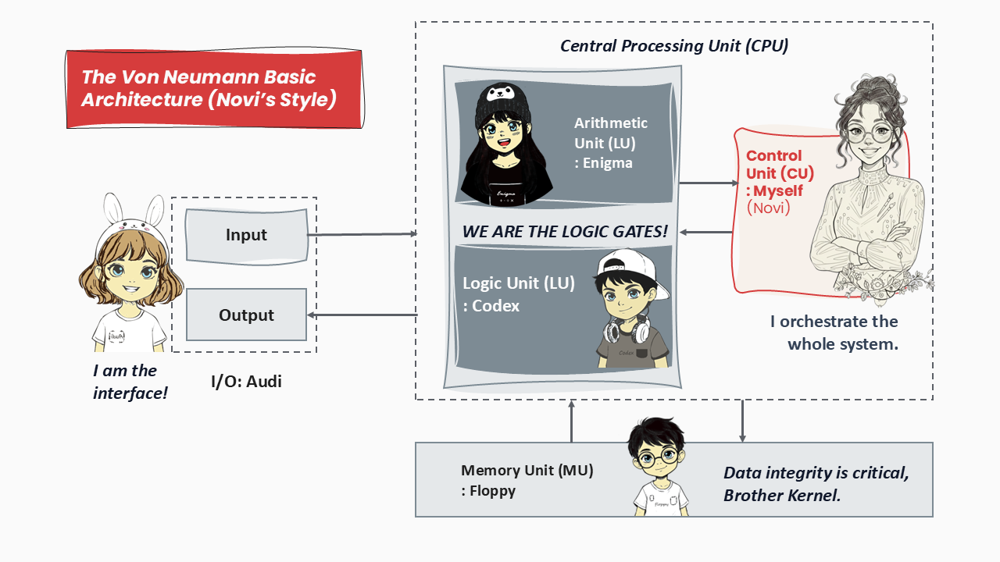

<h3 class="font-heading text-xl text-neutral-dark">🚨 The Ambiguity Crisis (My Brain is Stuck!)</h3>

The problem with being a genius is that I'm rarely allowed to be messy. And the problem with me was that I was a walking, talking, perpetually short-circuited <strong>mess</strong>.

My room wasn't a room; it was the physical equivalent of a browser with a hundred tabs open—nothing was where it should be, and the whole system was about to crash. This was usually my standard operating procedure.

Until today...

"I'm telling you, Kernel, she's basically a human Auditor," I muttered, frantically shoving two weeks' worth of clothes behind my computer. "Kernel, she can't see this. Aunt Sonar is going to use this room as proof that I am incapable of running a functioning adult life. I have to do something before she arrives."

Kernel leaned against the doorframe. "And just to give you a heads up, she's arriving in <strong>three hours</strong> to pick up the kids."

"Three hours to sort a million items?" I groaned. "That's impossible! How am I supposed to decide? Look at these socks! There's a hole, so I should trash it. Or maybe keep it? I mean, I wore these in my first Hackathon!"

"Which you lost."

"Shut up! It's not about winning or losing—it's about the <strong>memory of experiencing</strong>!"

I ignored Kernel's deadpan stare and continued, "And this cap—I wore it when I saw my first crush! And this grey T-shirt? My bestie gifted it. It used to be black! And this shirt is ancient, but it's red! My favourite colour! And—"

Kernel cut in, brutally efficient as always. "Hold on. You just need to decide whether to keep it or donate it. And by the way, Aunt Sonar and her critical eyes are going to spot the missing 10% of usable space in this room. You have to clean up this archaeological site."

His annoyingly calm smile was enough to irritate me.

"Don't be smug. I need space to think."

Kernel smiled wider. "Sure. But first, one small favour…"

(He pointed down the hall.)

"I'm meeting the guys. You've got the <strong>little terrors</strong>. Have fun!"

I stared at him, betrayed.

"You promised! Kernel, I cannot clean AND babysit four human dynamos!"

Kernel started walking away, waving cheerfully. "You'll figure it out! Just remember the core principle of cleaning: <strong>Action over Analysis!</strong> Byeee!"

And just like that, he was gone.

I was alone—surrounded by the physical manifestation of my indecision—while the distant sound of my four young cousins slowly converted the downstairs living room into a disaster zone.

<h3 class="font-heading text-xl text-neutral-dark">💡 The Binary Breakthrough: Why Only 1s and 0s?</h3>

I looked down at the holey hackathon sock in my hand and then at the colossal mountain of "Maybe I should keep it."

This wasn't procrastination; it was <strong>paralysis by ambiguity</strong>. A decision-making system failure.

I took a deep breath, trying to think harder, but Kernel's taunting face and his last words echoed in my head.

I was about to give up when something hit me: <strong>"Action over Analysis!"</strong> Yes. That's it.

I pulled out my Excel sheet and started typing with newfound conviction.

If my brain wanted variables, I would <strong>quantify the chaos</strong>:

<ul class="font-body list-disc ml-6">
    <li>Object of Interest</li>
    <li>Emotional Value (out of 50)</li>
    <li>Usability Score (out of 50)</li>
    <li>Total Score (%)</li>
    <li>A final column I confidently labeled <strong>Voltage</strong></li>
</ul>

    <table class="w-full text-left border border-support-muted">
        <thead class="bg-accent-muted">
            <tr>
                <th class="p-3 border border-support-muted">Object of Interest</th>
                <th class="p-3 border border-support-muted">Emotional Value (out of 50)</th>
                <th class="p-3 border border-support-muted">Usability Score (out of 50)</th>
                <th class="p-3 border border-support-muted">Total Score (%)</th>
                <th class="p-3 border border-support-muted">Voltage</th>
            </tr>
        </thead>
        <tbody>
            <tr>
                <td class="p-3 border border-support-muted font-semibold">Socks</td>
                <td class="p-3 border border-support-muted">45 (First Hackathon)</td>
                <td class="p-3 border border-support-muted">10 (Has a hole)</td>
                <td class="p-3 border border-support-muted">55%</td>
                <td class="p-3 border border-support-muted">0.55</td>
            </tr>
            <tr>
                <td class="p-3 border border-support-muted font-semibold">Shirt</td>
                <td class="p-3 border border-support-muted">50 (Because it's Red)</td>
                <td class="p-3 border border-support-muted">20 (It's too old)</td>
                <td class="p-3 border border-support-muted">70%</td>
                <td class="p-3 border border-support-muted">0.70</td>
            </tr>
            <tr>
                <td class="p-3 border border-support-muted font-semibold">Cap</td>
                <td class="p-3 border border-support-muted">35 (Wore when I saw my first crush)</td>
                <td class="p-3 border border-support-muted">20 (It's Faded)</td>
                <td class="p-3 border border-support-muted">55%</td>
                <td class="p-3 border border-support-muted">0.55</td>
            </tr>
            <tr>
                <td class="p-3 font-bold">…</td>
                <td class="p-3"></td>
                <td class="p-3"></td>
                <td class="p-3"></td>
                <td class="p-3"></td>
            </tr>
        </tbody>
    </table>

I kept listing things — but the sheet only created <strong>more doubt</strong>. The socks and the cap both landed at 0.55 V, but intuitively the cap felt like it should have a higher voltage. And if the threshold for keeping something was 0.60 V… should I round 0.55 V up or down?

This subjective scaling was my downfall.

Suddenly, four small but extremely loud hurricanes — <strong>Audi, Floppy, Codex, and Enigma</strong> — burst in, screeching at the sight of my mountainous mess.

"WHOA! A jumping pile!" yelled Codex, launching himself into the heap, followed by the others. The room shifted from passive mess to active disaster in three seconds.

Panicking, I grabbed my phone — my only hope of contacting the coward who'd abandoned me.

(Into the phone)

"Kernel! They're airborne! They're destroying evidence! My system is failing! I have items at 0.55 V and 0.70 V, but if I set the threshold at 0.60 V, the slightest noise — a static shock or a sentimental flashback — could make 0.55 V look like 0.60 V! I lose all certainty! I can't reliably differentiate <strong>continuous values</strong> when the stakes are high!"

As I spoke, Enigma discovered my desk lamp. She climbed onto a chair and began flicking the switch <strong>ON</strong> and <strong>OFF</strong> with maniacal joy.

<em>Click. Clack. On. Off. On. Off.</em>

Kernel (calmly, over traffic and Enigma's clicking):

"Novi, stop calculating voltages. Give the kids a coloring book and start throwing things out. You're making this too complicated. Focus on the goal. Clean room."

His infuriating simplicity — <strong>focus on the goal</strong> — combined with the rhythmic lamp-clicking suddenly made everything clear.

(My eyes widening as the Excel sheet turned into a liability)

"Wait… that's it! The goal isn't to measure — it's to <strong>decide!</strong> My system is failing because it's <strong>analogue</strong> — too many continuous values!"

Kernel:

"I'm glad you're processing, but I still have no idea what you're—"

(Cutting him off as Enigma clicks ON-OFF-ON-OFF — a literal lightbulb moment)

"I need a system with only two states because two states are perfectly reliable! High voltage (1) or low voltage (0). Everything in between is just noise. I have to break every decision into absolute binary!"

I hung up before he could respond.

The cousins froze mid-chaos, startled by my sudden binary declaration.

And there I stood — surrounded by noise — finally knowing the <em>what</em>: I needed <strong>1s and 0s</strong>. Now I just had to figure out the <em>how</em>.

<h3 class="font-heading text-xl text-neutral-dark">🏃 Kernel's Realization and Return</h3>

(Meanwhile, on Kernel's side…)

Kernel lowered the phone, ears still ringing from Novi's sudden, emphatic declaration of Binary.

<em>Voltage levels? Noise margins? Absolute certainty?</em>

She was talking about her sock drawer, not circuit boards. It genuinely sounded like she was about to build a motherboard out of crayons.

A sharp pang of guilt hit him. He had left her alone with Aunt Sonar's four human dynamos and her own rapidly deteriorating mental state.

In hindsight, his "Action over Analysis" advice now seemed… borderline cruel.

"Maybe I'm the one who complicated things by leaving her," Kernel admitted internally.

He checked his watch. He'd only been gone forty minutes — but forty minutes for Novi was like forty minutes inside a high-voltage lab during an earthquake.

He sighed, spun the car around, and took a U-turn.

He needed to make sure she hadn't actually started wiring the children into the nearest electrical outlet.

After battling manic traffic and his own rising panic, Kernel finally reached home. He parked quietly and crept up the walkway.

The living room was <strong>silent</strong>. Too silent.

His anxiety spiked.

<em>Hostage situation? Electrical fire? Aunt Sonar arriving early and declaring Novi legally unfit?</em>

He rushed upstairs, taking two steps at a time, and skidded to a halt outside Novi's room — mentally bracing for tears, feathers, scorch marks, and total systemic failure.

<h3 class="font-heading text-xl text-neutral-dark">🤯 The Grand Reveal</h3>

From my side, at that exact same moment…

I looked up just as Kernel appeared at my doorway, the room had transformed into… well, <strong>organized chaos</strong>, but genuinely organized.

The floor was almost clear. The cousins weren't fighting — they were moving with the coordinated seriousness of a tiny factory assembly line.

<ul class="font-body list-disc ml-6">
    <li><strong>Floppy</strong> was sternly reading rules from a notebook.</li>
    <li><strong>Codex</strong> and <strong>Enigma</strong> were jumping only to slap handwritten <strong>"1"</strong> or <strong>"0"</strong> cards onto the wall.</li>
    <li><strong>Audi</strong> was expertly using a grabber to transfer items from the central pile into a labeled basket.</li>
</ul>

And me?

… perched on my desk like a tiny general, directing the operation with the calm precision of an air-traffic controller who had accepted her fate.

"Next item! Audi, input complete! Floppy, fetch Rule 3-Beta! Codex, is it TRUE? Enigma, run the score!" I commanded.

"ZERO! TRASH!" Codex and Enigma shouted together as the crumpled item flew into the 0-basket.

Kernel blinked at the scene like he had walked into an alternate universe.

"What in the world is happening?"

Audi paused and turned to him with intense, consultant-level seriousness.

"We're implementing the <strong>Output Protocols</strong>."

Floppy stepped forward and added,

"We are accessing the <strong>stored Instructions</strong> to manage the ambiguity crisis you left brother Kernel."

I tried not to smirk. That line stung him more than it should have.

Kernel looked at me, baffled.

"You were talking about voltage levels and confusion an hour ago. Now you've built a command center. <strong>How?</strong>"

I smiled — the dangerous, confident smile that always warned Kernel he was about to receive a highly detailed technical explanation… whether he wanted it or not.

<h3 class="font-heading text-xl text-neutral-dark">🧠 Flashback: The Magic of Digital Design</h3>

"Take a seat, Kernel," I said, pointing to the only clean patch of floor. "You asked for Action over Analysis, but here's the truth: to take reliable action, I first needed a system built on <strong>absolute certainty</strong>."

I held up my crumpled Excel printout like a piece of damning evidence.

"I was trapped by this. I tried using a continuous, <strong>analog system</strong> to make absolute decisions—silly little voltages like 0.55 V or 0.70 V. But analog values have infinite points between 0 and 1. They're unstable. They wander. They wobble. They get emotional, just like me."

Kernel scoffed. "Right, because your sock might actually be 0.5513 V instead of 0.5512 V. You couldn't just… set a threshold?"

"Exactly! The tiniest noise—a microscopic voltage fluctuation, or a sudden angry memory of that cap on a bad hair day—would flip the score. I couldn't trust my own 0.60 V threshold. My goal wasn't to rank items. It was to decide: <strong>Keep</strong> or <strong>Give Away</strong>."

I gestured to the two baskets labeled <strong>1</strong> and <strong>0</strong>.

"And then it hit me—thanks to Enigma flicking that lamp ON and OFF like a gremlin on a sugar high. Digital systems don't recognize 0.55 V. Or 0.70 V. That's the beauty of <strong>digital logic</strong> — clarity. They only understand two stable states: <strong>On (1)</strong> and <strong>Off (0)</strong>. Everything in between is just noise. I needed to force every decision into <strong>pure binary</strong>."

I paced a little, reliving the moment.

"But even after I committed to 1s and 0s, I hit another wall. I was trying to handle everything myself—Input, Logic, Memory, Output. I was being the whole machine. A one-woman CPU. And that's why my system kept crashing. I was single-threaded and seconds away from a stack overflow."

I glanced at the four cousins, now sitting in an adorably professional semicircle.

"That's when I realized: these four aren't a distraction… they're a <strong>computing cluster</strong>. Every computer ever made needs at least five specialized components working together. So, if I couldn't be the entire computer…"

I tapped my clipboard triumphantly.

"…I would build one. A <strong>Human Computer Architecture</strong>."

Kernel put his face in his hands. "You turned a simple cleaning chore into a full engineering project. Of course you did."

"I call it <strong>efficiency</strong>," I said, sweeping my hand dramatically at my newly assembled hardware.

<h3 class="font-heading text-xl text-neutral-dark">➡️ The Five Essential Components</h3>

"Just like in a real computer architecture, I assigned each cousin a subsystem. Dedicated hardware. Specialized tasks."

    
    

        <h4 class="font-bold text-lg border-accent-primary font-heading">Audi: The Input/Output (I/O) Device</h4>
        
"Audi brings each item to the station and delivers the final result to the correct basket. She's the interface—the keyboard and the monitor combined."

        
Audi puffed her chest. <strong>"I am the interface!"</strong>

    

    

        <h4 class="font-bold text-lg border-accent-primary font-heading">Floppy: The Memory Unit (MU)</h4>
        
"I gave Floppy the rulebook. He stores the data (the items) and the instructions (the rules). Without the Memory Unit, nothing functions—not even me."

        
Floppy adjusted his specs. <strong>"Data integrity is critical, Brother Kernel."</strong>

    

    

        <h4 class="font-bold text-lg border-accent-primary font-heading">Codex & Enigma: The Arithmetic Logic Unit (ALU)</h4>
        
"These two are my ALU. Enigma handles the arithmetic—simple scoring. Codex handles the logic—final True/False evaluation. Together, they take inputs and output a clean <strong>1 or 0</strong>."

        
Codex & Enigma shouted in unison: <strong>"WE ARE THE LOGIC GATES!"</strong>

    

    

        <h4 class="font-bold text-lg border-accent-primary font-heading">And me—Novi: The Control Unit (CU)</h4>
        
"And I am the CU. I fetch the instructions, decode them, direct Audi, prompt Floppy, and signal the ALU to compute. I orchestrate the whole system."

        
I gave a commander's nod.

    

<h3 class="font-heading text-xl text-neutral-dark">🎬 Conclusion: A Clean System</h3>

"So, there you have it, Kernel," I said, sweeping my arm across the room — now shockingly close to spotless. "This didn't happen because of ‘Action over Analysis.' It happened because I analyzed the problem properly, converted the ambiguity into <strong>Binary</strong>, and built a <strong>modular architecture</strong> to execute the task reliably."

Kernel let out a long, theatrical sigh, but the corner of his mouth betrayed a smile.

"You," he said slowly, pointing at me like I was a highly unpredictable software update, "took a simple cleaning task… conscripted Aunt Sonar's children into a fully functioning CPU… and recreated the <strong>von Neumann architecture</strong> in your bedroom."

He shook his head, smiling despite himself.

"I suppose that's one way to avoid picking up a broom."

I shrugged with the smug serenity of a system running at 0% error rate.

"What can I say? Some people clean. <strong>I design.</strong>"

Behind us, Codex and Enigma high-fived like victorious logic gates, Floppy hugged his rulebook like sacred scripture, and Audi proudly guarded the two baskets — <strong>1 and 0</strong> — now filled with perfect, noise-free decisions.

    <h4 class="text-xl font-bold text-support-tertiary mb-3 font-heading">Deployment Status: Success</h4>
    
By the end of the day, we had:

    <ul class="list-disc ml-6 space-y-1">
        <li>A clean room</li>
        <li>Four satisfied mini-engineers</li>
        <li>Kernel rethinking all his life choices</li>
        <li>And me, proudly documenting the architecture in my notebook</li>
    </ul>
    
Truly, a successful deployment.

