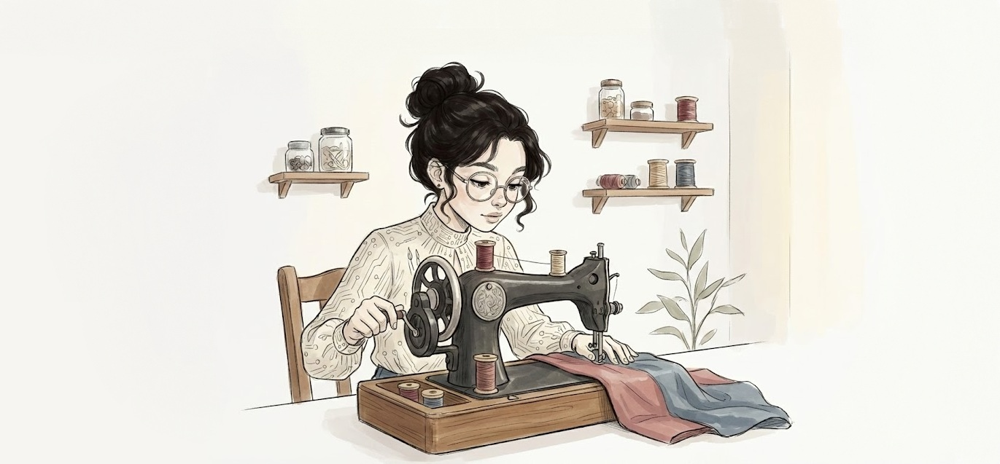

<h1>My Side Hustle Gave Me Real Hustle</h1>

<h2>😫 The Hard Stop</h2>

    Kernel isn't home today. 
    That itself is a problem. 
    Not because I can't function without him — I can. 
    But when machines break, Kernel is the kind of person who can fix them easily. 
    I am the kind of person who talks to them.

    This morning, I was stitching. 
    Calm stitching. 
    The good kind. 
    The foot pedal kept a steady rhythm. 
    The needle dipped in and out like it knew exactly where it belonged. 
    Cotton thread pulled tight, then rested — like a breath taken at the right moment.

    These pouches matter. 
    They're part of my premium branding service — hand-stitched, tactile, personal. 
    The kind of thing people touch twice before putting away.

    A client wants exactly 100 of them for an event tomorrow morning. 
    Not 98. 
    Not "around a hundred." 
    One. Zero. Zero.

    And then— 
    The machine stopped. 
    Not politely. 
    Not with a warning sound. 
    It jammed.

    The needle froze mid-dip, as if it had suddenly changed its mind about existence. 
    The belt made a weak, offended noise. 
    I reached for the hand wheel — my comfort — and it wouldn't move.

    I oiled it. 
    Tapped it. 
    Restarted it. 
    Nothing.

I stared at the half-stitched pouch trapped under the needle, like it had betrayed me personally.

    That's when my phone rang. 
    Client. 
    "Just checking — everything is on track, right?"

    I looked at the unfinished stack beside me. 
    Clean numbers are cruel.

    "Yes," I said. 
    My voice sounded braver than my wrists felt.

    After the call, panic stopped being abstract. 
    It became physical — tight fingers, shallow breath, the urge to shake the machine like it could be scared into cooperation.

    The local repair guy said, 
    "Madam, this model is too old."

    Offline stores shook their heads. 
    One shopkeeper smelled like grease and rust. He wiped his hands on a rag and said, 
    "Parts are unavailable. We'll need to order them for manufacturing. Two to three weeks."

    Another didn't even hesitate. 
    "Automatic only. No manual."

    One brightened briefly. 
    "We have automatic with a manual handle. Default is automatic. You just pull this clutch before using."

Tomorrow morning echoed in my head.

    In the middle of all this, my phone rang again. 
    Aunt Sonar. 
    "Where are you? Your house is locked from outside," she said. 
    "You remember you were supposed to give binary lessons to Codex and Enigma? They have an exam tomorrow. Hope you didn't forget."

    I had forgotten. 
    Completely.

If I didn't rush back home, Aunt Sonar would declare me unreliable — publicly, dramatically, and forever. Possibly with witnesses.

    I went home. 
    Settled the kids down. 
    Aunt Sonar left, satisfied but suspicious.

    I opened my laptop and searched again, just in case. 
    Delivery dates laughed out loud. 
    Then suggested I relax.

    From the corner of the room, Enigma said, 
    "We have a test on binary addition tomorrow."

    I sighed. 
    Reluctantly, I pulled out my whiteboard.

    The machine was broken. 
    The order was exact. 
    Time had no sympathy. 
    And somehow, I was about to teach binary addition.

<h2>👇 The Workaround Nobody Asked For</h2>

    I picked up the marker and faced the board. 
    Half-hearted writing. 
    The kind where the hand moves but the mind is still stuck somewhere else — under a jammed needle, inside a missed deadline.

"The rules of binary addition," I said, more to the board than to the kids.

I wrote:

    0 + 0 = 0  
    0 + 1 = 1  
    1 + 0 = 1  
    1 + 1 = 10

"So if we need to add—"

I wrote:

&nbsp;&nbsp;110 + 111 ------- -------

"Then—"

    "Wait," Codex said. 
    Not softly. 
    "But in the book, it's written differently."

    That snapped me out of it. 
    I turned. "Differently how?"

    He pushed the book toward me, finger already marking the page. 
    There it was, printed confidently, like this was the proper way to think:

<strong>Conversion Method</strong>

    Step 1: Binary → Decimal 
    Step 2: Add 
    Step 3: Decimal → Binary

    I stared at it for a second. >
    Then I wiped the board clean. >
    Not angrily. >
    Decisively.

    "Okay," I said, picking the marker up again. 
    "Remember last week's lesson?"

Both of them nodded.

    "I already taught you this method then," I continued, writing as I spoke. 
    "So this is not new. This is just using it."

The board filled up again, slower this time.

    110 = 1x2² + 1x2¹ + 0x2⁰ = 6 
    111 = 1x2² + 1x2¹ + 1x2⁰ = 7

"First you convert," I said.

"Then you add."

    6 + 7 = 13

"And then you convert back."

    13 = 1101

    "That's it," I said. 
    "That's what the book is doing."

I stepped aside so they could see the whole thing at once.

    "It's slower," I added, almost apologetically. 
    "But it works."

    I tore a page from my notebook and slid it toward them. 
    "Do a few on your own," I said. 
    "Use the same steps. Convert, add, convert back."

    The room went quiet except for pencil scratches and whispered powers of two. 
    I leaned against the table. 
    And somewhere between <strong>6 + 7 = 13 and 13 = 1101</strong>, another voice slipped in.

    The shopkeeper. 
    "Default is automatic. You just need to pull this clutch."

    I looked at the board again. 
    Not elegant. 
    Not direct. 
    But usable.

    I checked the time. 
    Tomorrow morning. 
    Exactly 100.

    I grabbed my bag. 
    "Keep practicing," I said, already moving toward the door. 
    "I'll be back."

    I wasn't fixing the old machine. 
    I was going to buy the one that would work.

<h2>⚡Back in Motion</h2>

    I came straight back from the shop. 
    No detours. No bargaining guilt. Just… bought it. Done.

    "Progress?" I asked, glancing at the kids. 
    They nodded. Too quickly. Suspiciously. 
    I didn't ask more. Not yet.

    First, the machine. 
    I set it up. Checked the height. Foot pedal. 
    Threaded it carefully — top spool, tension discs, take-up lever, needle eye. 
    Bobbin in. Plate closed.

    The motor hummed. 
    Sweet, normal hum. 
    Not the old one, but close enough.

I stitched a test piece.

    ✔ Stitch quality 
    ✔ Accuracy 
    ✔ Familiarity

    For a moment, the day unclenched. 
    Okay. Delivery looks possible again. I exhaled.

Back to the pouches. Stitching resumed.

Immediately… wrists hurt.

    Every time I need to sew, I have to switch it to manual mode. Pull the clutch. Then pedal. 
    Pull clutch. Pedal. 
    Pull clutch. Pedal.

    My wrists felt like they were being counted out in binary — one pain, zero relief. 
    Rhythm broke. 
    Pace uneven. 
    Time slipping through my fingers like it had somewhere better to go.

    I'm correct. 
    I'm producing. 
    I'm also… exhausted.

    I paused. Stretched my fingers. Thought: maybe check the kids. 
    They're still at the table. Pencils scratching. Not much movement.

    "How many done?" I asked. 
    Silence. 
    Codex mumbled, "Four."

    "Four… in an hour?" 
    It sounded like a question. It wasn't meant to.

    Enigma sighed. "Numbers are large." 
    Codex added, "Conversion is taking time."

    I looked at the page. Stuck on the fifth question. 
    I rubbed my forehead. 
    They were correct. 
    But slow. 
    Exhausting — for them and for me.

<h2>🤓 The Direct Way</h2>

    I picked up the notebook. 
    Checked the work. 
    Everything was correct. 
    Six-digit, seven-digit numbers. Painfully correct.

    I shook my head. 
    "Okay," I said, "can I teach you a better method?"

    Codex stiffened immediately. 
    "But it's not in the syllabus."

"It will be faster," I said.

    Enigma frowned. 
    "But it will be difficult. Exam is tomorrow."

    I paused. 
    Then said, slowly, 
    "What if I tell you… it's not new?"

They looked at me.

"What if I say you already know it?"

Silence.

    "It's the same maths you've been doing in decimal," I said. 
    "Nothing extra. Just realised differently."

    I pulled the whiteboard closer. 
    "Forget conversion for a moment. Just add."

I wrote:

&nbsp;&nbsp;110 + 111 ------- -------

    "Start from the right. Same as always." 
    I pointed. "0 + 1 = 1." 
    I wrote 1.

    "Next column. 1 + 1 = ?"

They both replied, "2"

"In decimal, yes. In binary, we can't write 2."

So, I wrote:

1 + 1 = 0 
carry 1

    "Same rule as 8 + 7 = 15. You write 5, carry 1." 
    I drew the carry above the next column.

    "Now add everything in this column." 
    "1 (carry) + 1 + 1 = 3."

They paused.

"In binary," I continued, "3 is written as 11."

I wrote:

1 + 1 + 1 = 1 

<strong>"Write 1. Carry 1 again."</strong>

I moved to the next column.

"Now we only have the carry."

"1."

I completed the addition:

&nbsp;&nbsp;110 + 111 ------ &nbsp;1101

    "No conversion," I said. 

    Codex stared at the board. 
    "So, carry keeps moving… until it finishes?"

    "Yes," I said. 
    "Exactly like decimal."

    Enigma leaned closer. 
    "So binary addition is just column-wise addition, but carry rules change?"

    "Carry rules don't change," I corrected gently. 
    "Only the base does."

    They sat back. 
    This pause felt different. 
    Not stuck. 
    Settling.

    "Try the next one," I said. 
    "Direct method only."

    Behind me, the machine hummed. 
    In front of me, numbers finally moved faster. 
    And this time, no one complained.

<h2>🤔 Same Reluctance</h2>

    I went back to the machine. 
    Pull clutch. 
    Pedal. 
    Pull clutch again. 
    Pedal.

    My wrists protested immediately. 
    And that's when I noticed it.

    This feeling. 
    This no, I'll manage it myself stubbornness.

    This is exactly what Codex and Enigma were doing. 
    Not in the syllabus. 
    Too late to learn. 
    Tomorrow is the exam.

I stood there for a second, hands still on the machine.

    I'm not scared of the machine.
    I'm scared of letting it take over. 
    Like I'll lose control if I let it run.

Just like they felt about the direct method.

    I stopped. 
    Let my hands rest. 
    Then — quietly — I switched to automatic.

    No announcement. 
    No big decision sound.

    Pedal. 
    The machine moved. 
    Smooth. Even. 
    Like it had been waiting for me to stop fighting it.

    I actually laughed. 
    "Oh," I said to nobody, "so that's it."

    The stitches flowed. One after another. 
    No breaks. 
    No wrist pain. 
    No interruptions.

    Behind me— 
    "I finished one," Enigma said. 
    "Me too," Codex said. "And it's correct."

    I didn't turn around. 
    Didn't need to. 
    Everything was moving now. 

    That's when Aunt Sonar appeared at the door. 
    She looked at the table. 
    Then the machine. 
    Then the kids. 

"Hm," she said. "Everyone seems busy."

    I smiled. 
    The machine hummed. 
    The numbers flowed. 
    No one was stuck. 

    Nothing was finished yet. 
    But nothing was stuck anymore. 

And for the first time today, everything was going in the right direction.

