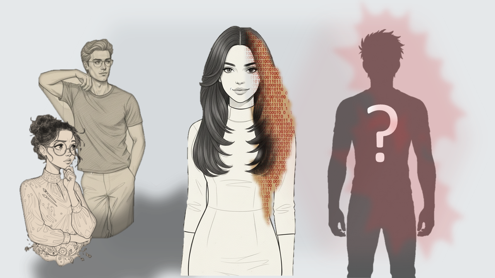

<h1>The Smile That Wasn't Hers</h1>

<h2>🧮 A Variable Enters the System</h2>

    It was a quiet Saturday. The kind of morning that feels like a clean sheet of paper.

    I was dragging my favorite floor lamp toward the study. Then the books. Then my favorite blanket.

    Kernel didn't say anything. But his silence followed me around the room, asking questions without using words.

    "Novi," he finally said, "why does it look like you're shifting your entire life into the study?"

    I stopped and gave him my most convincing smile. The one I use when I bring home another stray plant I absolutely don't have room for.

    "Just for a few days."

    Kernel paused. Not froze—paused. Like someone doing math they don't like.

    "Why?" he asked.

    "A guest is coming," I said quickly, dropping a stack of books onto the floor. "Just for a few days."

    Kernel went very still.

    <em>Not again.</em>

    He didn't say it, but I heard it anyway.

    To Kernel, the house is a perfectly balanced equation. A guest is a variable he did not account for.

    The doorbell rang. Sharp. Real.

    I leaned closer to him and whispered, "Be nice. Just for a few days. Please. She's going through something really harsh."

    "Who?" Kernel asked.

    I didn't answer. I was already running toward the door.

<h2>🎭 The Forced Smile</h2>

    I opened the door.

    Pal was standing there—looking smaller than the day she first walked into our house by mistake.

    Behind me, I felt Kernel stop mid-step. He recognized her instantly.

    Pal. Once a system error in our living room. Now, somehow, my friend.

    Kernel still hadn't worked out the logic of that transition.

    She walked in smiling. But it wasn't a real smile.

    It was a construction. Something held up by sheer willpower—like a bridge still standing only because no one had told it to collapse yet.

    The kind of smile that tries to convince the room before it convinces the person wearing it.

    "Hi, Novi," she said. Then, looking past me, "Hello, Kernel."

    Kernel didn't answer right away. He didn't judge. He observed.

    He watched how she placed her bag on the floor. Not dropped. Not released. Placed—carefully. Precisely.

    As if even her weight needed permission. As if she were afraid the house couldn't handle her.

    "I'll make coffee," I said, already moving toward the kitchen. "The good kind."

    She nodded. Another smile.

    She was smiling so much it started to hurt my face just watching her.

    But when she looked at me—really looked—the shine was gone. No light. Just a flat, grey exhaustion.

    The smile wasn't happiness. It was armor.

<h2>⛏️ The Crack in the Mask</h2>

    The coffee went cold before Pal even finished half of it.

    She sat on the edge of the sofa; her hands wrapped around the mug as if it were the only thing keeping her upright.

    "He's just… gone quiet," she whispered. She didn't name him. She didn't have to.

    "It's like I'm speaking a language he's forgotten how to hear. I try to explain how I feel, and he just looks through me. Or he walks away."

    She looked up at me. For a second, the forced smile was gone.

    "I think I'm losing him, Novi. Or maybe I've already lost myself trying to find him."

    I reached for her hand.

    In my head, the gears were already turning. I saw a problem. And to me, every problem has a solution—if you just rotate it enough.

    "We'll fix it," I said, full of that high-bandwidth certainty I carry. "It's just a mismatch, Pal. We just need to bridge the gap."

<h2>🧩 The Puzzle Theory</h2>

    "He must be hurting too," I whispered to Kernel later that night.

    Kernel watched me the way a debugger watches a line of code it knows will eventually crash.

    "Maybe he's scared," I continued, pacing. "Maybe Pal just needs to communicate better. Relationships are puzzles, right? You keep rotating the pieces until they click."

    Kernel didn't argue. That should have been my first warning.

    Over the next few days, Pal followed my advice. She communicated. She explained. She waited.

    And with every attempt, she got quieter.

    She wasn't getting angry. She was getting reduced.

    Like a file compressed so many times that the resolution starts to disappear.

<h2>🕳️ The Math of Empty Spaces</h2>

    After Pal's door clicked shut one night, I finally snapped.

    "Why isn't it working?" I demanded. "She's doing everything right."

    Kernel leaned against the counter. He looked tired.

    "Because the plan is draining her, Novi. This relationship isn't a puzzle," he said. "It's a leak. And she's the only one losing energy. It's becoming toxic."

    "Toxic is a strong word," I argued. "She's strong. Everyone has something left in the tank."

    Kernel studied me. Then sighed.

    "Okay," he said softly. "Let's do it your way."

<h2>🤲 The Borrow</h2>

    Kernel pulled out the whiteboard. He drew four boxes.

    Inside them, he wrote:

<pre>
1 0 0 0
</pre>

    "Binary," I murmured.

    "Think of this as Pal's energy," Kernel said. "A 4-bit system. Right now, her value is eight. Now subtract one."

    Underneath, I wrote:

<pre>
0 0 0 1
</pre>

    "Walk me through it," he said.

    I nodded.

    Binary subtraction works column by column, from right to left.

<ul>
    <li>0 - 1 can't be done directly. There's nothing to subtract from.</li>
    <li>The system borrows from the nearest available bit.</li>
    <li>If that bit is 0, the borrow propagates left until a 1 is found.</li>
    <li>That 1 becomes 0.</li>
    <li>The borrowed value travels back through the zeros until subtraction completes.</li>
</ul>

    I finished the result:

<pre>
0 1 1 1
</pre>

    "The operation succeeds," I said. "The system keeps running."

    Kernel circled the leftmost 0.

    "Yes," he said. "But look at the cost."

<aside class="bg-support-muted/5 p-3 my-10 rounded-lg border-l-4 border-accent-primary">
    <h4 class="font-heading font-semibold text-neutral-dark text-base mb-2">
        Binary Sidebar — Borrowing Is Not New
    </h4>

    

        Binary subtraction borrows in the same way decimal subtraction does. When you subtract 1 from 10 in decimal, you borrow from the 1, turning it into 0 and converting the 0 into 10 so the subtraction can complete. Binary works the same way—just with base-2 instead of base-10. When a bit doesn't have enough value, it borrows from the nearest higher 1. If that bit is 0, the borrow propagates left until a 1 is found. The math succeeds, but the highest-value bit permanently loses capacity. Borrowing solves the immediate problem by consuming future stability.
    

</aside>

<h2>📉 Propagation Cost</h2>

    "To get that single '1' at the end," Kernel said, "the system consumed its most significant bit.

    That bit represents stability. Health. Future capacity."

    "Borrowing in binary is allowed. But it is never free. Every borrow creates debt upstream."

    I stared at the board.

    "The smile she shows him?" Kernel continued quietly. "It isn't new energy. It's borrowed. She's paying today with pieces of her tomorrow."

    The result no longer looked correct. It looked like erosion.

<h2>😔 The Realization</h2>

    I looked at Pal's closed door.

    I had been watching the result of the math. Not the cost.

    She was still standing. Still smiling. And I thought that meant the system was healthy.

    I hadn't counted the zeros I helped create.

    "Borrowing keeps a system alive," Kernel said quietly. "It doesn't keep it whole."

    I understood then.

    Pal wasn't staying because things were improving.

    She was staying because the system hadn't crashed yet.

    And every day she stayed, the borrow propagated backward—into places she wouldn't feel until much later.

    We stood there—me, Kernel, and a closed door—watching a system report success while running on debt it could never repay.

